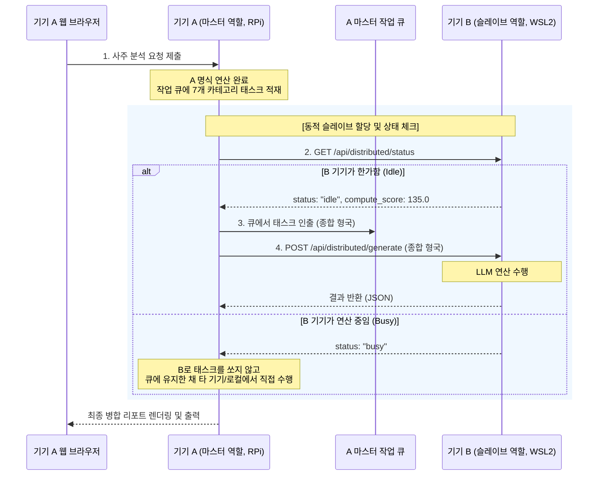

# Oracle 분산 추론 및 하이브리드 로드밸런싱 아키텍처 가이드

본 문서는 사주 및 관상 분석용 LLM 분산 추론 환경에서 기기별 성능 편차와 탑재된 모델 체급 차이에 대응하고, 최적의 해석 품질과 시스템 처리 속도를 동시에 만족하기 위해 구현된 하이브리드 P2P 분산 추론 스케줄링 아키텍처를 설명합니다.

---

## 1. 하이브리드 P2P 분산 추론 모델

하이브리드 모드(Hybrid Mode)는 **"평소에는 마스터(독립 웹 UI 서버)로서 동작하지만, 본인의 로컬 연산 자원이 유휴(Idle) 상태일 때는 네트워크 내 다른 기기의 슬레이브 역할을 수행"**하는 대칭형 협력 구조입니다.

### 1.1. 가상 네트워크 시나리오 및 예시
마스터 겸 슬레이브로 동작하는 하이브리드 디바이스 A(라즈베리파이, IP: `192.168.0.28`)와 기기 B(WSL2 데스크톱, IP: `192.168.0.13`)가 상호 등록되어 연결된 경우입니다.

1. **상호 연결 설정 (기동 옵션)**:
   * **기기 A**: `./run.sh --distributed-role hybrid --slave-addrs http://192.168.0.13:8501`
   * **기기 B**: `./run.sh --distributed-role hybrid --slave-addrs http://192.168.0.28:8501`
2. **동적 역할 조율**:
   * **기기 A**의 웹 화면으로 사주 분석 요청이 들어오면, 기기 A가 해당 세션의 **마스터**가 되어 태스크(7개 블록)를 공용 작업 큐에 적재합니다.
   * 기기 A는 기기 B의 상태 API(`/api/distributed/status`)를 호출해 B가 바쁜지(Busy) 확인합니다.
   * 기기 B는 현재 자신의 사용자가 없어 유휴 상태(`idle`)라면, 기기 A의 워커 스레드가 전송하는 추론 요청(`POST /api/distributed/generate`)을 받아 **슬레이브처럼 연산을 돕고** 결과를 반환합니다.
   * 기기 B에서 실제 사용자가 웹 UI 접속을 시도하여 로컬 추론을 시작하는 순간, B는 즉시 `busy` 상태로 전점유됩니다. 기기 A는 B가 바쁘다는 응답을 감지하고 남은 작업을 공용 큐에 반납하여 자신이 직접 연산하거나 한가한 다른 노드로 예외 라우팅(Rerouting)합니다.

---

## 2. 하이브리드 연산 제어 흐름 (Sequence Diagram)



---

## 3. 부하분산 및 품질-속도 제어 메커니즘 (Load Balancing)

다양한 성능의 디바이스(CPU, GPU, 임베디드)와 모델(1.5B, 9B 등)이 혼재하는 분산 환경에서 병목을 최소화하고 결과물의 지능적 완성도를 유지하기 위해 적용된 3대 연산 제어 메커니즘입니다.

### 3.1. 캐시 안전 자가 벤치마크 (Cache-Safe Auto-Profiling)
기기별 실시간 연산 성능(TPS)을 실측하되, **진짜 사용자의 실제 요청을 처리하기 위해 보존 중인 추론 엔진의 프롬프트 캐시(KV Cache) 슬롯을 더럽히지 않도록(Evict/Evaporation 방지)** 설계되었습니다.

* **동작 원리**:
  1. 기동 시점 또는 첫 상태 요청 시 로컬 LLM을 상대로 1회성 초단기 자가 측정을 실행합니다.
  2. 시스템 프롬프트(`prefix`)를 완전히 생략한 아주 콤팩트한 5토큰짜리 단일 `user` 더미 프롬프트(`"1"`)만 전송합니다.
  3. llama.cpp API 호출 페이로드에 **`"cache_prompt": false`**를 명시하여 추론 엔진의 캐시 테이블 수정을 원천적으로 차단합니다.
  4. 측정된 지연 시간과 반환 토큰 수(`completion_tokens`)를 통해 기기의 순수 연산 속도(TPS)를 도출하고 메모리에 캐싱합니다.
  * *폴백(Fallback)*: 만약 로컬 LLM 서버 미기동 등의 이유로 벤치마크가 실패하면, 기본 속도 `1.0 TPS`(기본 성능 스코어 `2.0`)를 임시 부여해 서버 중단을 막고 실시간 요청 수행 시의 TPS 데이터를 통해 자연스럽게 보정되도록 유도합니다.

### 3.2. 연산 체급 점수 (Compute Score) 정의
단순한 물리 속도(TPS)에 모델의 파라미터 크기(Billion 단위)를 곱하여, **더 똑똑하고 무거운 모델을 돌리는 기기일수록 더 높은 체급 점수**를 부여받도록 설계했습니다.

$$\text{Compute Score} = \text{TPS (초당 토큰 수)} \times \text{Model Parameter Size (B)}$$

* **모델 크기(Billion) 유추**:
  * 슬레이브는 본인이 돌리고 있는 모델 파일의 이름(예: `gemma-4-E2B-it`, `gemma-3-1b-it` 등)을 분석하여 파라미터 크기를 자동으로 판별합니다.
  * 예: 파일명에 `1b` 포함 시 1.0, `2b` 포함 시 2.0, `e2b/gemma-4` 포함 시 9.0 등
* **예시 비교**:
  * **WSL2 노드 (Gemma 4 9B)**: TPS는 15 Token/sec로 측정되지만, 체급 점수는 $15 \times 9 = \mathbf{135}$점.
  * **라즈베리파이 노드 (Gemma 3 1.5B)**: TPS는 30 Token/sec로 더 빠르지만, 체급 점수는 $30 \times 1.5 = \mathbf{45}$점.
* 마스터 노드는 각 기기의 헬스 체크 API `/api/distributed/status` 로부터 이 `compute_score`를 상시 수집하여 가중치 맵을 업데이트합니다.

### 3.3. 중요도 기반 태스크 라우팅 (Task-to-Model Routing)
사주 해석 카테고리 중 문장력과 추론 능력이 극도로 중요한 핵심 카테고리는 고품질 모델을 탑재한 노드가 전담하도록 제약 조건을 부여합니다.

* **필터링 규칙**:
  * **핵심 카테고리**: `종합 형국`, `타고난 성향과 심리 패턴`, `총평 및 인생의 조언`
  * **라우팅 제한**: `compute_score`가 **`20.0`** 미만인 기기(저성능 기기 또는 경량 모델 탑재 노드)가 태스크 큐에서 핵심 카테고리 작업을 가져갔을 경우, 작업을 즉시 큐에 반납(`task_queue.put(task)`)하고 대기합니다.
  * **데드락(Lock) 방지**: 네트워크 내에 `compute_score >= 20.0`인 고성능 노드가 단 하나도 활성화되어 있지 않을 경우(예: 라즈베리파이들로만 분산망이 구성된 경우)에는 저스펙 기기도 막힘없이 모든 작업을 평소처럼 처리합니다.

---

## 4. Busy 상태 자율 회피 및 재조회 메커니즘 (Backoff & Rerouting)

하이브리드 디바이스 혹은 슬레이브 기기가 다른 연산을 처리 중이어서 바쁜 경우(`busy` 상태), 시스템의 병목을 방지하기 위해 다음과 같은 동적 우회 처리가 수행됩니다.

1. **태스크 즉시 반납**:
   * 전담 워커 스레드가 큐에서 작업을 하나 인출한 후 타겟 슬레이브의 상태가 `busy`임을 확인하면, 해당 작업을 쥐고 대기하지 않고 **즉시 공용 태스크 큐로 다시 밀어 넣습니다 (`task_queue.put(task)`)**.
   * 이로 인해, 마스터 자신이나 다른 한가한 하이브리드 노드들이 대기 시간 없이 즉시 해당 작업을 가져가 처리(대신 추론)할 수 있는 기회가 제공됩니다.
2. **백오프 대기 (Backoff Delay)**:
   * 작업을 반납한 워커 스레드는 슬레이브 기기가 한가해질 때까지 연속적인 호출을 보내지 않고, **정확히 1.0초간 휴식(`time.sleep(1.0)`)**하며 슬레이브 기기에 가해지는 오버헤드를 방지합니다.
3. **재조회 주기**:
   * 1.0초간의 대기 시간이 끝나면 워커 스레드는 다시 큐에서 다음 대기 작업을 가져와 슬레이브의 상태를 재조회(Polling)하여 통신을 재조율합니다.

---

## 5. 핵심 구현 소스 코드 레퍼런스

### 5.1. 캐시 안전 벤치마크 및 체급 점수 산출 (`llm.py`)
```python
# LlamaCppChatClient 내부
def get_or_measure_tps(self) -> float:
    with self._tps_lock:
        if self._measured_tps is not None:
            return self._measured_tps

    # 캐시를 절대 건드리지 않도록 cache_prompt: False 지정 및 시스템 프롬프트 미포함
    payload = {
        "model": self._config.model,
        "messages": [{"role": "user", "content": "1"}],
        "max_tokens": 5,
        "temperature": 0.1,
        "stream": False,
        "cache_prompt": False
    }
    # ... http post로 호출 후 TPS 측정 및 캐싱
```

### 5.2. 작업 기여도 라우팅 및 자율 반납 (`workflow.py`)
```python
# worker_loop 내부 태스크 인출 및 검사부
compute_score = status_data.get("compute_score", 5.0)

# 핵심 카테고리 검사
is_core_category = cat in ("종합 형국", "타고난 성향과 심리 패턴", "총평 및 인생의 조언")
if is_core_category and compute_score < 20.0:
    # 네트워크상에 핵심 카테고리를 대신 처리할 고성능 노드가 있는지 검사
    other_high_perf_exists = any(
        meta.get("compute_score", 0.0) >= 20.0 
        for meta in scheduler.slave_metadata.values()
    )
    if other_high_perf_exists:
        task_queue.put(task) # 큐에 반납
        task_queue.task_done()
        time.sleep(0.5)
        continue
```
