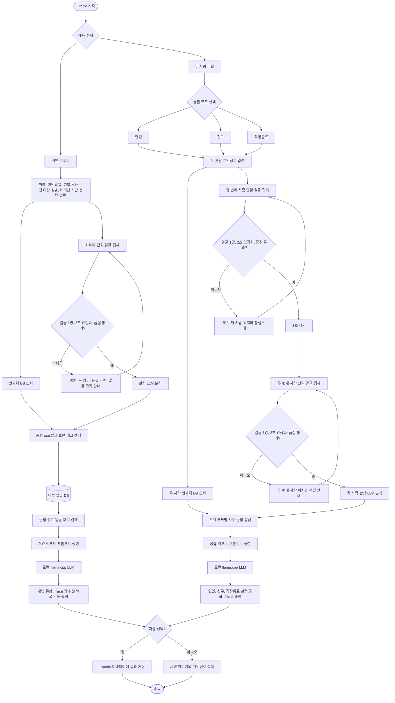

# Oracle On-Device Service Blueprint

## 목적

Oracle은 라즈베리파이 기반 온디바이스 키오스크에서 얼굴 사진과 최소 개인정보를 입력받아 관상, 사주, 궁합을 엔터테인먼트 리포트로 제공하는 서비스다. 모든 촬영, 사주 계산, 얼굴 품질 검사, 내부 얼굴 DB 검색, LLM 리포트 생성은 로컬 장치 안에서 실행한다.

서비스는 처음 화면에서 두 가지 메뉴를 제공한다.

1. 개인 리포트: 관상과 사주를 종합한 개인 리포트, 내 관상과 궁합이 좋은 얼굴 추천
2. 두 사람 궁합: 두 사람의 개인정보를 먼저 입력받고, 한 사람씩 순차 촬영해 연인, 친구, 직장동료 모드별 궁합 리포트 생성

결과는 운세와 관상 기반의 참고용 콘텐츠로만 제공한다. 얼굴 사진으로 신원, 나이, 민족, 건강, 직업, 경제력 같은 민감하거나 중대한 속성을 추정하지 않는다.

## 기준 디바이스

`docs/raspberry_pi.md` 기준으로 Raspberry Pi 4/5급 장치를 보수적 기본값으로 둔다.

- 카메라: USB 카메라 또는 libcamera/Picamera2로 노출되는 CSI 카메라
- 기본 입력 프레임: 640x480, 15 FPS
- 얼굴 탐지 입력: 0.5배 축소한 320x240
- 얼굴 탐지 주기: 2프레임마다 1회
- 캡처 조건: 얼굴이 2초 이상 안정적으로 유지될 때 저장
- LLM 서버: `llama-server` 로컬 서버, 기본 URL `http://127.0.0.1:8080/v1`
- 운영 모드: 키오스크에서는 미리보기 창을 끄고, 현장 디버깅 때만 켠다.

멀티모달 GGUF 모델과 projector 설정이 준비되지 않은 장치에서는 이미지 자체를 LLM에 보내지 않는다. 대신 얼굴 품질, 랜드마크 기반 보조 특징, 사주 룰엔진 결과를 텍스트 프롬프트로 넘긴다.

## 입력

### 개인 리포트

- 얼굴 사진: 카메라 캡처 1장
- 이름
- 생년월일
- 성별 또는 추천 대상 성별
- 태어난 시간: 선택 입력

태어난 시간이 없으면 MVP에서는 정오 12:00 기준 시지를 조회하되 `birth_time_known=False`로 표시한다. 리포트에서는 이 값을 확정 시간으로 단정하지 않고 시간 미상 기준의 보조 해석으로 취급한다.

### 두 사람 궁합

- 얼굴 사진: 첫 번째 사람 캡처 1장, 3초 대기 후 두 번째 사람 캡처 1장
- 사람 A의 이름, 생년월일, 성별 또는 관계상 역할, 태어난 시간 선택값
- 사람 B의 이름, 생년월일, 성별 또는 관계상 역할, 태어난 시간 선택값
- 궁합 모드: 연인, 친구, 직장동료

두 사람 메뉴에서는 두 사람의 개인정보를 먼저 입력받아 만세력 DB 조회를 시작하고, 이후 한 사람씩 순차 캡처한다. 첫 번째 사람이 촬영되면 3초 뒤 두 번째 사람 촬영을 시작한다.

## 출력

### 개인 리포트

Markdown 또는 키오스크 HTML 화면으로 아래 내용을 출력한다.

- 한 줄 요약
- 사주 명식과 오행 밸런스
- 일간 중심 성향
- 관상 보조 풀이
- 사주와 관상을 종합한 흐름
- 강점과 주의할 점
- 생활 조언
- 내 관상과 궁합이 좋은 얼굴상 설명
- 내부 DB 기반 추천 얼굴 카드

추천 얼굴 카드는 실제 인물 평가가 아니라 내부 DB에 등록된 동의 기반 이미지 또는 합성 이미지의 얼굴상 태그를 기준으로 제공한다. 예시는 `부드러운 인상`, `선명한 눈매`, `둥근 윤곽`, `차분한 표정`처럼 설명형 태그로 노출한다.

### 두 사람 궁합 리포트

궁합 모드에 따라 출력 관점을 바꾼다.

- 연인: 정서적 호흡, 갈등 패턴, 애정 표현 방식, 장기 관계 조언
- 친구: 대화 리듬, 신뢰 형성, 취미와 활동 궁합, 거리감 조절
- 직장동료: 협업 방식, 의사결정 속도, 역할 분담, 커뮤니케이션 주의점

공통 출력은 아래로 구성한다.

- 두 사람의 한 줄 궁합 요약
- 사주 기반 상호 보완점
- 관상 보조 인상 궁합
- 모드별 강점
- 모드별 주의할 점
- 관계를 좋게 만드는 행동 제안
- 참고 문구

## 용어와 DB 기준

서비스 내부에서는 DB 원천 데이터를 `만세력 DB`로 부른다. 만세력은 생년월일시를 천간과 지지 기반의 사주명식으로 변환하는 기초 자료이고, 여기에 성별을 더해 대운 순행/역행 같은 성별 의존 정보를 함께 저장한다.

LLM 프롬프트와 사용자 리포트에서는 `사주정보`라는 표현을 함께 사용한다. 사주정보는 만세력 DB에서 조회한 년주, 월주, 일주, 시주, 오행, 대운 방향을 리포트 작성에 맞게 가공한 입력이다.

기본 배포 DB는 `data/manse.sqlite`이며 1900-2100년 전체 날짜를 포함한다. 저장 방식은 `생년월일 + 12개 시지`를 기본 행으로 두고, 성별에 따라 달라지는 대운 방향은 남성/여성 컬럼에 같이 저장한다. 따라서 런타임 조회는 생년월일, 태어난 시간, 성별을 모두 입력받지만 DB 행 수는 `전체 날짜 수 x 12개 시지`로 유지한다.

만세력 DB에는 최소한 아래 조합이 미리 존재해야 한다.

- 생년월일
- 태어난 시간의 12개 시지 구간
- 성별: 남성, 여성
- 년주, 월주, 일주, 시주
- 오행 분포
- 일간
- 대운 방향

런타임에서는 DB 조회가 실패해도 사주 룰엔진으로 즉석 계산하지 않는다. 누락된 데이터는 `./build.sh` 또는 `oracle-build-manse-db`로 사전에 생성한다.

## 온디바이스 구성

### 1. 키오스크 UI

라즈베리파이 화면 또는 터치 디스플레이에서 실행되는 로컬 Flask UI다. Streamlit보다 의존성과 런타임이 가벼운 Flask를 사용해 `./run.sh` 기본 실행 시 웹 앱을 띄운다.

- 시작 화면: 개인 리포트, 두 사람 궁합
- 입력 화면: 개인정보 입력, 태어난 시간 선택 입력
- 촬영 화면: 얼굴 위치 안내, 품질 경고, 자동 캡처
- 결과 화면: 리포트 보기, QR 또는 로컬 파일 저장 선택

### 2. 얼굴 캡처와 품질 게이트

현재 구현된 `oracle_report.vision` 구조를 확장한다.

- `HaarFaceDetector`: 라즈베리파이 기본 얼굴 탐지
- `FaceCaptureHarness`: 2초 안정화 상태 머신
- `OpenCvFaceQualityAnalyzer`: 눈 감김, 눈썹 가림, 얼굴 크기 경고
- 구현 방식: 개인 캡처 하네스를 재사용해 첫 번째 사람과 두 번째 사람을 순차 캡처
- 추가 예정: 촬영 전 카운트다운 UI, 카메라 프레임 소스 추상화 강화

라즈베리파이 성능을 고려해 캡처 단계에서는 무거운 모델을 계속 돌리지 않는다. 얼굴이 안정화된 뒤 캡처 직전에만 품질 분석과 보조 특징 추출을 수행한다.

### 3. 사주 룰엔진

현재 `oracle_report.saju`를 기준 엔진으로 사용한다.

- 생년월일시가 있으면 기존 간지 산출과 오행 분포를 사용한다.
- 태어난 시간이 없으면 시간주를 제외한 해석을 제공한다.
- 궁합 기능에서는 두 사람의 일간, 오행 분포, 상생/상극, 균형 요소를 비교한다.

### 4. 관상 보조 특징 추출

관상은 LLM이 사진만 보고 임의 단정하지 않도록 구조화된 보조 입력으로 만든다.

- MVP: 현재 품질 정보와 얼굴 박스 비율, 정면성, 표정 안정성 중심
- 확장: MediaPipe Face Mesh 또는 경량 랜드마크 모델로 얼굴형, 눈매 방향성, 눈썹 간격, 입꼬리 방향 같은 비식별 특징 추출
- 금지: 얼굴로 신원, 나이, 민족, 건강, 직업, 경제력, 실제 성격을 단정하는 추정

### 5. 내부 얼굴 DB 추천

개인 리포트의 추천 기능은 SQLite 기반 로컬 DB로 시작한다.

DB는 다음 정보를 가진다.

- 이미지 파일 경로
- 동의 또는 합성 이미지 여부
- 추천 대상 성별 또는 스타일 카테고리
- 얼굴상 태그
- 관상 태그
- 사주 보완 태그
- 노출 가능 여부

검색은 아래 순서로 진행한다.

1. 사용자 사주에서 부족하거나 보완하면 좋은 오행을 산출한다.
2. 관상 보조 특징으로 사용자의 인상 태그를 만든다.
3. `사주 보완 태그 + 얼굴상 태그 + 추천 대상 성별` 조건으로 후보를 필터링한다.
4. 점수 상위 후보를 3개 정도 보여준다.
5. 결과에는 사진과 함께 추천 이유를 짧게 표시한다.

실제 인물 사진을 쓸 경우 명시적 동의, 로컬 저장, 삭제 가능성, 외부 전송 금지를 운영 정책으로 둔다. 가능하면 초기 DB는 합성 이미지 또는 사전 동의된 모델 이미지로 구성한다.

### 6. 로컬 LLM 리포트 생성

`oracle_report.report`와 `oracle_report.llm` 구조를 유지한다.

- LLM은 `localhost`, `127.0.0.1`, `::1`만 허용한다.
- 사주 룰엔진 결과를 1차 근거로 사용한다.
- 관상은 구조화된 보조 특징으로만 사용한다.
- 출력 포맷은 메뉴와 모드별 Markdown 템플릿으로 고정한다.
- 라즈베리파이에서는 작은 quantized GGUF 모델을 기본으로 사용하고, 응답 토큰 수를 제한한다.

## 구현 Plan

### Phase 1. 제품 골격 정리

- CLI 명령을 메뉴 기준으로 재정리한다.
- `personal-report`, `compatibility-report` 실행 흐름을 분리한다.
- `BirthProfile`에 `gender`, `birth_time_known` 또는 `birth_time: datetime | None` 모델을 추가한다.
- 태어난 시간 미입력 사주 해석을 지원한다.
- 기존 단일 리포트 테스트를 새 모델 구조에 맞게 갱신한다.

### Phase 2. 두 사람 순차 캡처와 궁합 모델

- `PersonProfile`과 `CompatibilityRequest` 모델을 추가한다.
- 두 사람의 개인정보 입력 후 만세력 DB 조회를 먼저 시작한다.
- 첫 번째 사람 단일 얼굴 캡처 후 3초 대기하고 두 번째 사람 단일 얼굴 캡처를 실행한다.
- 각 사람의 얼굴 품질 게이트와 관상 LLM 분석을 별도로 실행한다.
- 연인, 친구, 직장동료 enum을 추가한다.
- 사주 궁합 룰엔진을 추가한다.
- 모드별 리포트 프롬프트와 테스트를 작성한다.

### Phase 3. 내부 얼굴 DB 추천

- `data/face_db.sqlite` 또는 설정 가능한 DB 경로를 추가한다.
- 얼굴 이미지 저장 경로와 메타데이터 스키마를 만든다.
- 추천용 태그 스키마를 정의한다.
- 사주 보완 태그와 관상 보조 태그를 기반으로 후보 검색을 구현한다.
- 추천 결과를 개인 리포트 프롬프트에 연결한다.
- DB가 비어 있을 때는 추천 섹션을 자연스럽게 생략한다.

### Phase 4. 키오스크 UI

- MVP는 Flask 기반 로컬 웹 UI로 메뉴 선택을 구현한다.
- 촬영 화면에는 얼굴 위치, 안정화 시간, 품질 경고만 표시한다.
- 결과 화면은 Markdown을 HTML로 렌더링한다.
- 키오스크 운영에서는 브라우저 full screen과 systemd 자동 실행을 사용한다.

### Phase 5. 라즈베리파이 최적화

- 기본값은 `configs/raspberry_pi.env`와 일치시킨다.
- 얼굴 탐지 프레임 축소, 탐지 주기, 버퍼 크기를 유지한다.
- 품질 분석과 랜드마크 분석은 캡처 직전에만 실행한다.
- LLM 응답 토큰 수와 context size를 제한한다.
- Pi 4에서는 텍스트 전용 LLM을 기본값으로 두고, Pi 5 8GB 이상에서만 비전 모델을 선택 옵션으로 둔다.

### Phase 6. 개인정보와 운영 정책

- 촬영 전 동의 문구를 UI에 넣는다.
- 기본 저장 정책은 세션 임시 저장 후 자동 삭제로 둔다.
- 사용자가 저장을 선택한 결과물만 `reports/`에 남긴다.
- 내부 얼굴 DB 이미지는 동의 기반 또는 합성 이미지로 제한한다.
- 로그에는 이름, 생년월일, 원본 이미지 경로를 남기지 않는다.

## 현재 구현 상태

- `./build.sh`: apt 패키지, Python venv, Python 의존성, llama.cpp 빌드, `.env` 생성을 이미 준비된 항목 기준으로 스킵한다.
- `./run.sh`: 상단 설정 블록으로 Flask host/port, 로컬 LLM 주소, 모델 경로, 카메라, DB 경로를 제어한다.
- UI: Flask 기반 개인 리포트와 두 사람 궁합 메뉴를 제공한다.
- 개인 리포트: 개인정보 입력 후 만세력 DB 조회와 단일 얼굴 캡처를 병렬 실행한다.
- 두 사람 궁합: 두 사람 개인정보 입력 후 만세력 DB 조회를 시작하고, 첫 번째 사람 촬영 후 3초 뒤 두 번째 사람을 순차 촬영한다.
- LLM: 관상 분석 LLM과 최종 리포트 LLM 설정을 분리한다.
- DB: 사전 생성된 SQLite 만세력 DB와 SQLite 얼굴 추천 DB를 사용한다.
- 만세력 DB 조회 실패 시 런타임에서 사주 엔진으로 즉석 계산하지 않고 오류를 안내한다.
- 테스트: 실제 카메라와 LLM 없이 개인/궁합 워크플로우를 검증한다.

## Mermaid Flow Chart

동일한 현재 구현 흐름의 PlantUML 버전은 `docs/oracle_flow.puml`에 있다.

## 우선 구현 범위

가장 먼저 만들 MVP는 개인 리포트 메뉴의 완성도다. 현재 코드가 이미 단일 얼굴 캡처, 사주 룰엔진, 로컬 LLM 리포트를 갖고 있으므로 아래 순서가 가장 작다.

1. 개인 메뉴 입력 모델 정리
2. 태어난 시간 선택값 처리
3. 개인 리포트 출력 템플릿 확장
4. 내부 얼굴 DB 스키마와 샘플 데이터 추가
5. 추천 얼굴 카드 섹션 연결
6. 두 사람 궁합 요청 모델과 리포트 프롬프트 추가
7. 두 사람 순차 캡처 흐름 추가
8. 키오스크 UI 추가
